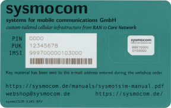

# 📶 Red GSM (2G) con LimeSDR y Osmocom

> **⚠️ Advertencia:** Configurar una red GSM implica el uso de frecuencias que, en general, están muy reguladas. En la mayoría de las jurisdicciones, transmitir en estas frecuencias sin la debida autorización es ilegal y está sujeto a severas sanciones.

> Familiarícese con las leyes locales de telecomunicaciones y sea consciente de los riesgos legales y operativos, incluyendo la posibilidad de causar interferencias con los servicios de emergencia y las comunicaciones públicas. Le recomendamos explorar la posibilidad de usar jaulas de Faraday o conexiones directas desde la estación base (SDR) a la estación móvil (como un teléfono inteligente) para evitar el uso no autorizado del espectro.

> El autor y el editor de esta guía rechazan explícitamente cualquier responsabilidad por el uso ilegal o cualquier resultado adverso derivado de seguir esta guía. La responsabilidad de cualquier acción tomada recae exclusivamente sobre usted.

Esta guía proporciona un método sencillo para configurar una red GSM básica utilizando [LimeSDR], software del proyecto [Osmocom] y un ordenador con Linux.

GSM es la tecnología de red celular digital de segunda generación (2G) de la que dependían las comunicaciones móviles. Ha quedado obsoleta desde hace tiempo debido a sus limitaciones y vulnerabilidades de seguridad bien documentadas, y ha sido reemplazada por estándares más nuevos como UMTS (3G), LTE (4G) y, más recientemente, 5G. Sorprendentemente, a pesar de su obsolescencia, ¡incluso los smartphones más actuales siguen siendo compatibles con GSM!

La configuración descrita en esta guía admite llamadas de voz y SMS entre los suscriptores de la red GSM y es capaz de enviar alertas de emergencia a través de [CB (Cell Broadcast)]. También proporciona acceso a internet, aunque la baja velocidad de las tecnologías 2G (GPRS y EDGE) la hace poco práctica para usar sitios web y aplicaciones modernas, ya que incluso cargar una página sencilla puede tardar varios minutos. Debería ser posible habilitar llamadas hacia y desde otros operadores mediante [OsmoSIPConnector], software PBX y un proveedor de servicios SIP compatible.
Sin embargo, esto queda fuera del alcance de esta guía, ya que se centra en la creación de una red minimalista e independiente.

El propósito práctico de configurar una red GSM es cosa suya. Podría ser simplemente por entretenimiento o para explorar la evolución de los protocolos de comunicación móvil, incluyendo sus aspectos de seguridad. Estas redes GSM caseras a veces se presentan en eventos de hackers en todo el mundo como demostraciones divertidas, a pesar de su dudosa legalidad (consulte la [advertencia] al principio de esta guía).

[CB (Cell Broadcast)]:
https://osmocom.org/projects/cellular-infrastructure/wiki/Cell_Broadcast
[LimeSDR]: https://limemicro.com/products/boards/limesdr/
[Osmocom]: https://osmocom.org/
[OsmoSIPConnector]: https://osmocom.org/projects/osmo-sip-conector
[advertencia]: #-gsm-2g-network-with-limesdr-and-osmocom

### ¿Qué pasa con 3G y superiores?

El proyecto Osmocom es compatible con el estándar UMTS; sin embargo, su [documentación] indica la necesidad de un hNodeB de terceros, un componente de hardware independiente.

Si bien el hardware de LimeSDR probablemente sea compatible con el protocolo, no he podido encontrar documentación sobre alguien que lo haya utilizado con éxito para ese propósito. Las búsquedas en línea me han llevado a [OpenBTS-UMTS], un proyecto ya descontinuado, lo que dificulta encontrar recursos de apoyo. Dadas estas dificultades, y dado que 2G satisfizo mis necesidades experimentales, he decidido no continuar con 3G.

Para 4G y versiones posteriores, el proyecto [srsRAN] está bien establecido y ofrece ejemplos como una configuración [usando una Raspberry Pi 4 y SDR para crear un eNodeB].
Aunque aún no he experimentado con esto, sin duda está en mi lista de proyectos futuros.

[Documentación]:
https://osmocom.org/projects/cellular-infrastructure/wiki/Osmocom_Network_In_The_Box
[OpenBTS-UMTS]: https://github.com/RangeNetworks/OpenBTS-UMTS
[srsRAN]: https://www.srslte.com/
[Uso de una Raspberry Pi 4 y SDR para crear un eNodeB]:
https://docs.srsran.com/projects/4g/en/next/app_notes/source/pi4/source/index.html

## Consideraciones de seguridad

Es evidente que la tecnología 2G está obsoleta e insegura. Ninguna red GSM debe considerarse segura para la transmisión de información confidencial. Además, la creación de una red GSM como esta podría suponer riesgos tanto para el sistema anfitrión como para cualquier otra red (por ejemplo, Ethernet y Wi-Fi) conectada a él.

Los componentes del proyecto Osmocom utilizan diversos puertos TCP para distintos propósitos. Una característica clave es el VTY (terminal virtual), que permite al usuario conectarse, supervisar y ajustar la configuración de un componente en ejecución. En la configuración que estamos analizando, estos puertos están configurados para aceptar únicamente conexiones desde el equipo local (localhost) y no requieren autenticación. Esto significa que cualquier persona con acceso al sistema podría iniciar sesión, ejecutar comandos y cambiar la configuración de cualquier componente activo de Osmocom.

Si este nivel de acceso no se ajusta a sus necesidades, deberá profundizar en el...

Revise los archivos de configuración para reforzar la seguridad y considere estrategias como reglas de firewall que distingan entre usuarios, el uso de espacios de nombres de red, entre otras.

Tenga en cuenta que, dado que su red GSM ofrece acceso a internet, existe la posibilidad de que los suscriptores la usen indebidamente. El reenvío de paquetes podría exponer inadvertidamente a otros dispositivos de su red al acceso no autorizado de los usuarios de la red GSM. Por lo tanto, es recomendable implementar las reglas de firewall adecuadas.


## Configuración

Estas instrucciones de configuración se basan en un entorno Debian 12 ("Bookworm") con un LimeSDR conectado por USB. Si su configuración es diferente, es posible que deba realizar ajustes en estos pasos.


### Decidir sobre la autenticación

En las redes 2G, a diferencia de las 3G/4G/5G, la red autentica a los suscriptores, pero los dispositivos móviles no están obligados a autenticar la red. En efecto, esto significa que puede optar por una red "abierta" que autentica cualquier dispositivo que intente conectarse y, por lo tanto, no requiere el uso de una tarjeta SIM personalizada.

Su decisión de aplicar la autenticación afectará significativamente la forma en que los usuarios se conectan a su red y los pasos técnicos necesarios para su configuración.

Si opta por aplicar la autenticación, necesitará tarjetas SIM programables y deberá programarlas con parámetros de red específicos, incluyendo las listas PLMN[^1]
y la clave de autenticación (Ki)[^2]. Además, deberá agregar a cada suscriptor a la base de datos de red administrada por OsmoHLR.

Si opta por una red "abierta", los usuarios pueden seleccionar manualmente su red desactivando la selección automática de red en la configuración de su teléfono. Incluso sin forzar la autenticación, puede usar tarjetas SIM programables para conectarse automáticamente a su red (es decir, para que no sea necesario desactivar la selección automática de red), aunque no son necesarias para la conexión.

[^1]:
**PLMN (Lista Preferida de Redes Móviles)** se refiere a una lista almacenada en una tarjeta SIM que contiene las redes móviles a las que el suscriptor debe conectarse. El teléfono móvil utiliza esta lista para seleccionar automáticamente una de las redes cuando están disponibles.

[^2]:
**Ki** es un valor de 128 bits utilizado en el proceso de autenticación y cifrado entre el dispositivo móvil y la red GSM. Se almacena tanto en la tarjeta SIM del suscriptor como en la base de datos de la red, y se utiliza para autenticar a los usuarios autorizados en la red.

### Tarjetas SIM programables



Para tarjetas SIM programables, [sysmocom] es un proveedor reconocido y confiable.
Como alternativa, plataformas como Banggood y AliExpress ofrecen tarjetas SIM grabables a precios económicos, aunque la calidad y las características pueden variar.

Una posible preocupación con las tarjetas SIM de estas plataformas es que, en ocasiones, pueden requerir software proporcionado por los proveedores para escribir parámetros. A menudo, este software se describe como opaco: sus orígenes y funcionalidades no son transparentes, lo que genera preocupaciones legítimas sobre la seguridad y la integridad. Existe un riesgo real de que contengan malware.

Si necesita usar software proporcionado por proveedores de estas fuentes menos confiables, debe tomar precauciones, como ejecutar el software en una máquina virtual aislada.

[sysmocom]: https://shop.sysmocom.de/SIM/Cards/

### Instalar los paquetes necesarios

Primero, agregue el repositorio del proyecto Osmocom a su sistema. En Debian, la forma más sencilla de hacerlo es usando [extrepo]. Para otras versiones de Linux, consulte la [wiki de Osmocom].

```bash
apt install extrepo
extrepo enable osmocom-latest
apt update
```

A continuación, instale los siguientes paquetes.

```bash
apt install git \
telnet \
iptables \
limesuite \
osmo-hlr \
osmo-msc \
osmo-mgw \
osmo-stp \
osmo-bsc \
osmo-ggsn \
osmo-sgsn \
osmo-bts-trx \
osmo-trx-lms \
osmo-pcu \
osmo-cbc \
osmo-cbc-utils
```

Si aún no lo ha hecho, le recomendamos que aproveche esta oportunidad para comprobar que su LimeSDR está conectado, actualizado y funcionando correctamente. Para ello, ejecute `LimeUtil --update` y `LimeQuickTest`.

[extrepo]: https://manpages.ubuntu.com/manpages/focal/man1/extrepo.1p.html
[Wiki de Osmocom]:
https://osmocom.org/projects/cellular-infrastructure/wiki/Latest_Builds

### Clonar el repositorio

Este repositorio contiene los archivos de configuración básicos y los scripts auxiliares necesarios para nuestra configuración. Clónelo usando Git.

```bash
git clone git@github.com:undefined-name12/GSM-limesdr.git
```

### Personalizar la configuración

Dentro del repositorio clonado, navegue a `etc/osmocom` para encontrar los archivos de configuración de Osmocom relevantes. Actualice estos archivos según sus preferencias de red.

**Primero, en [osmo-bsc.cfg],** configure el MCC[^6] y el MNC[^7] para su red. Por defecto, tenemos Configuramos 724 como MCC porque está asociado con Brasil y 64 como MNC para evitar conflictos con las MNC de los operadores brasileños existentes.

```
Código de país de red 724
Código de red móvil 64
```

**En [osmo-ggsn.cfg]**, tiene la opción de personalizar la configuración de DNS e IP para evitar conflictos con sus redes existentes.

```
ip dns 0 8.8.8.8
ip dns 1 8.8.4.4
ip prefix dynamic 172.16.32.0/24
```

**A continuación, en [osmo-hlr.cfg],** observe las siguientes directivas:

- `ussd route prefix *#100# internal own-msisdn` proporciona un servicio USSD[^3] para mostrar el MSISDN[^4] del usuario marcando `*#100#`.

- `ussd route prefix *#101# internal own-imsi` proporciona un servicio USSD para ver el IMSI[^5] de la tarjeta SIM marcando `*#101#`.

- `subscriber-create-on-demand 8 cs+ps` habilita el registro automático de los dispositivos conectados a la red. Indica que a cada dispositivo se le debe asignar un MSISDN de 8 dígitos y se le debe permitir acceder a los servicios CS y PS.

**Edite [osmo-msc.cfg]** para que coincida con el MCC y el MNC que configuró previamente en `osmo-bsc.cfg`. Aquí también puede personalizar el nombre corto y el nombre largo de su red. Si decide requerir autenticación, debe cambiar la línea de autenticación a `authentication required`. Observe también la línea `encryption a5 0`, que deshabilita el cifrado; esto es necesario para las redes donde la autenticación está configurada como `opcional`.

```
Código de país de la red: 724
Código de red móvil: 64
Nombre corto: Miralium
Nombre largo: Miralium Research
Autenticación opcional
Cifrado: a5 0
```

**En [osmo-sgsn.cfg],** si decide requerir autenticación en su red, puede cambiar la línea `auth-policy accept-all` a `auth-policy closed`.

**Finalmente,** copie todos los archivos de configuración al directorio `/etc/osmocom` de su sistema. Para mayor comodidad, se proporciona un script en [src/update-cfg.sh].

[^3]:
**USSD (Datos de Servicio Suplementarios No Estructurados)** es una tecnología de mensajería que permite el intercambio bidireccional de una secuencia de datos, basado en sesiones. Uno de sus usos es proporcionar a los usuarios acceso a los servicios de red mediante la marcación de códigos cortos, que suelen empezar con \* y terminar con #, sin necesidad de conexión a internet.

[^4]:
El **MSISDN (Número Internacional de Directorio de Suscriptores de Estación Móvil)** es un número que identifica de forma única una suscripción en la red GSM. En pocas palabras, es el número de teléfono. Se almacena en la base de datos de la red, donde se puede consultar en relación con el IMSI.

[^5]:
El **IMSI (Identidad Internacional de Suscriptor Móvil)** es un identificador único para cada usuario de la red. Se almacena en la tarjeta SIM, consta de hasta 15 dígitos y está estructurado para incluir el MCC, el MNC y un número de suscriptor único.

[^6]:
El **MCC (Código de País Móvil)** es un código de tres dígitos asignado a cada país y que se utiliza para identificar el país al que pertenece un suscriptor móvil.

[^7]:
El **MNC (Código de Red Móvil)** es un código de dos o tres dígitos que se utiliza en combinación con el MCC para identificar a un operador de telefonía móvil dentro de un país. Cada operador tiene MNCs únicos (a menudo más de uno) que, al combinarse con el MCC, forman una identificación única de operador a nivel mundial. [osmo-bsc.cfg]: etc/osmocom/osmo-bsc.cfg
[osmo-ggsn.cfg]: etc/osmocom/osmo-ggsn.cfg
[osmo-hlr.cfg]: etc/osmocom/osmo-hlr.cfg
[osmo-msc.cfg]: etc/osmocom/osmo-msc.cfg
[osmo-sgsn.cfg]: etc/osmocom/osmo-sgsn.cfg
[src/update-cfg.sh]: src/update-cfg.sh

### Iniciar los servicios de Osmocom

Utilice el script [src/osmo-all.sh] para iniciar todos los servicios de Osmocom necesarios (es decir, ejecutando `src/osmo-all.sh start`). Es probable que los servicios ya se hayan iniciado automáticamente al instalarlos, por lo que se recomienda detenerlos por completo ejecutando `src/osmo-all.sh stop` (y, posiblemente, `src/osmo-all.sh kill`, si es necesario) antes de reiniciarlos.

[src/osmo-all.sh]: src/osmo-all.sh

### Configurar el enrutamiento

Una vez iniciado OsmoGGSN, creará una interfaz TUN llamada `apn0` desde la cual los suscriptores de la red GSM accederán a internet. Para que funcione, deberá:

1. Agregar una dirección IP a la interfaz recién creada (según la configuración en `osmo-ggsn.cfg`);

```bash
ip addr add 172.16.32.1/24 dev apn0
```

2. Activar la interfaz;

```bash
ip link set apn0 up
```

3. enable [IP forwarding];

```bash
sysctl -w net.ipv4.ip_forward=1
```

4. Configure iptables según corresponda. Como mínimo, deberá configurar NAT tanto para `apn0` como para la interfaz de red conectada a internet (en este ejemplo, `ens33`) y permitir el reenvío de paquetes entre esas interfaces.

```bash
iptables -t nat -A POSTROUTING -o ens33 -j MASQUERADE
iptables -t nat -A POSTROUTING -o apn0 -j MASQUERADE
iptables -A FORWARD -i apn0 -o ens33 -j ACCEPT
iptables -A FORWARD -i ens33 -o apn0 -j ACCEPT
```

Tenga en cuenta que **ninguna de estas configuraciones es persistente De forma predeterminada.** Si desea que persistan tras reinicios, deberá decidir qué estrategias utilizar (por ejemplo, editar `/etc/sysctl.conf`, usar scripts de inicio, instalar [iptables-persistent], entre otras opciones).

> **ℹ️ Atención:** configurar manualmente las reglas de iptables mientras [UFW] está instalado y habilitado puede causar conflictos. Para esta configuración, se recomienda desinstalar UFW y usar iptables directamente.

[Reenvío de IP]:
https://openvpn.net/faq/what-is-and-how-do-i-enable-ip-forwarding-on-linux/
[iptables-persistent]: https://packages.debian.org/bookworm/iptables-persistent
[UFW]: https://help.ubuntu.com/community/UFW

## Uso de la red

Si su red GSM está configurada para requerir autenticación, conectarse a ella es sencillo, siempre que su tarjeta SIM esté programada correctamente.
Simplemente inserte la tarjeta SIM en el dispositivo móvil y este debería encontrar y conectarse automáticamente a la red.

Si no utiliza tarjetas SIM personalizadas, el proceso de conexión implica algunos pasos adicionales, que pueden variar considerablemente según el sistema operativo del dispositivo móvil. Para dispositivos Android, vaya a _Ajustes_ › _Red e Internet_ › _Red móvil_, localice la opción _Seleccionar red automáticamente_ y desactívela.

Después de deshabilitar la selección automática, su dispositivo buscará las redes disponibles y se las mostrará. Es posible que su red GSM no aparezca en la lista por el nombre configurado, sino como una representación numérica compuesta por el MCC y el MNC que haya configurado (p. ej., “72464”). Al seleccionarla, su dispositivo debería conectarse a su red.


### Gestión de suscriptores

Puede gestionar suscriptores a través de la interfaz VTY de OsmoHLR. Por defecto, OsmoHLR vincula su VTY al puerto TCP 4258. Para conectarse, puede usar telnet, como se indica a continuación.

```bash
telnet 127.0.0.1 4258
```

Tras la conexión, aparecerá el símbolo del sistema de OsmoHLR. Para empezar, acceda al modo `enable`.

```shell
OsmoHLR> enable
```

Puede ver todos los comandos disponibles y obtener ayuda para los parámetros de un comando específico pulsando la tecla `?`.

Para redes que requieren autenticación, es necesario agregar suscriptores manualmente, especificando sus valores IMSI y Ki. Para crear un suscriptor, consulte el siguiente ejemplo y reemplace el marcador IMSI 724640000000000 por el IMSI real de la tarjeta SIM que está registrando.

```shell
OsmoHLR# subscriber imsi 724640000000000 create
% Created subscriber 724640000000000
ID: 1
IMSI: 724640000000000
MSISDN: none
```

Ahora, asigne un MSISDN a su suscriptor. En este caso, usaremos 12345678.
Recuerde que este es un marcador de posición y debe reemplazarse con el número de teléfono real que desea asignar.

```shell
OsmoHLR# subscriber imsi 724640000000000 update msisdn 12345678
% Updated subscriber IMSI='724640000000000' to MSISDN='12345678'
```

A continuación, especifique los parámetros de autenticación. Este ejemplo utiliza `comp128v1` como algoritmo AUC, pero, según la configuración de su tarjeta SIM, podría requerirse `comp128v3`. La clave de autenticación (Ki) proporcionada aquí es un marcador y debe reemplazarse por la clave de autenticación real de su tarjeta SIM.

```shell
OsmoHLR# subscriber imsi 724640000000000 update aud2g comp128v1 ki 00000000000000000000000000000000
```

Especifique el modo de acceso a la red (p. ej., cs+ps para acceso conmutado por circuitos y por paquetes).

```shell
OsmoHLR# subscriber imsi 724640000000000 update network-access-mode cs+ps
```

Para ver la información actualizada de un suscriptor, utilice el comando `show`.

```shell
OsmoHLR# subscriber imsi 724640000000000 show
ID: 1
IMSI: 724640000000000
MSISDN: 12345678
2G auth: COMP128v1
KI=00000000000000000000000000000000
```

### Llamadas y SMS

Una vez que un dispositivo se conecta a la red GSM, las llamadas y los SMS deberían funcionar correctamente. Para averiguar los números de teléfono a los que llamar o enviar mensajes, consulte el MSISDN de cada suscriptor. Puede hacerlo directamente desde el sistema host (por ejemplo, consultando el VTY de OsmoHLR) o utilizando el servicio USSD de un teléfono móvil para averiguar su número asignado (marque `*#100#`).

### Acceso a Internet

A diferencia de las llamadas y los SMS, el acceso a internet a través de tu red GSM podría requerir alguna configuración adicional en el dispositivo móvil.

En primer lugar, si tu red GSM está configurada sin autenticación o si la configuración PLMN de tu SIM es incorrecta, el dispositivo móvil podría pensar que está en roaming. Esto suele significar que desactivará automáticamente los datos para evitar cargos.
Para solucionar esto, puedes modificar la configuración de tu SIM, lo cual solo es posible si usas tus propias tarjetas SIM programables, o activar el roaming de datos.

Para determinar si tu teléfono Android está en roaming, simplemente observa la barra de estado en la parte superior de la pantalla. Si ves una "R" junto a las barras de intensidad de la señal, esto indica que el teléfono está actualmente en modo roaming.


_Símbolo de roaming mostrado en un smartphone Android por The RedBurn, Mark Groves en
[Wikimedia Commons]_

A continuación, tu dispositivo requerirá la configuración del APN (Nombre del Punto de Acceso) para acceder a internet correctamente. Normalmente, los operadores envían esta configuración a los suscriptores mediante [actualizaciones OTA], pero aquí la configuraremos manualmente.

Para usuarios de Android, ve a _Ajustes_ › _Red e Internet_ › _Red móvil_
› _Nombres de Puntos de Acceso_. Aquí, agrega un nuevo APN con el nombre y el valor que prefieras. Solo asegúrate de que el MCC y el MNC coincidan con tu configuración. Después, guarda tu nuevo APN y selecciónalo para conectarte.

He visto teléfonos antiguos que no son Android con diferentes requisitos de configuración. En esos casos, podrías necesitar explorar los menús y averiguar qué configuraciones pueden faltar.

> **ℹ️ Aviso:** En mi experiencia, me ha resultado extremadamente difícil que los smartphones Android modernos utilicen correctamente la red GSM para acceder a internet. Sospecho que el sistema y sus aplicaciones podrían estar enviando demasiados datos a la vez, posiblemente sobrecargando la red y, a menudo, asumiendo que la conexión no está disponible cuando en realidad sí lo está, simplemente es extremadamente lenta. Para ese propósito, usar los teléfonos antiguos parece funcionar mejor.

[Roaming]: https://en.wikipedia.org/wiki/Roaming
[Wikimedia Commons]:
https://commons.wikimedia.org/wiki/File:Roaming_symbol_Android.svg
[Habilitar roaming de datos]: https://www.youtube.com/watch?v=bhRNJJK0-aA
[Actualizaciones OTA]: https://stackoverflow.com/a/63635659

## Alertas de emergencia


Puedes emitir alertas de emergencia en la red GSM utilizando la API REST de OsmoCBC. El paquete `osmo-cbc-utils` proporciona una herramienta de línea de comandos llamada `cbc-apitool.py` para interactuar con dicha API.

Por ejemplo, el siguiente comando envía un mensaje de alerta extrema a la red.

```bash
cbc-apitool.py create-cbs \
--msg-id 4371 \
--payload-data-utf8 "Algo ha sucedido."
```

Según mi experiencia, transmitir estas alertas y garantizar que los dispositivos de la red las reciban correctamente puede ser algo complicado. Por lo tanto, es recomendable familiarizarse con los detalles de la tecnología CB.

Algunos problemas que podrían surgir:

- Los dispositivos podrían tener los mensajes de alerta de emergencia deshabilitados o, en casos excepcionales, podrían no ser compatibles.

- Los mensajes que comparten el mismo ID y número de actualización se tratan como idénticos, independientemente de las diferencias en su contenido. Por lo tanto, si crea un mensaje con un ID específico, lo elimina e intenta enviar uno nuevo sin modificar el número de actualización, es posible que los dispositivos que recibieron el mensaje inicial no muestren el siguiente.

- Problemas de longitud del contenido y codificación de caracteres pueden provocar que los dispositivos no muestren las alertas.

> **ℹ️ Aviso:** en Android, la configuración de alertas de emergencia suele estar en
> _Ajustes_ › _Notificaciones_ › _Alertas de emergencia inalámbricas_. En iOS, busca
> _Ajustes_ › _Notificaciones_ › _Alertas gubernamentales_.
>
> 

## Lecturas adicionales

La tecnología celular y sus componentes relacionados, incluido el proyecto Osmocom,
son fascinantemente complejos. Aunque esta guía te ofrece una ruta sencilla
para configurar una red GSM rápidamente, te recomendamos profundizar en el tema para
comprenderlo mejor.

El proyecto Osmocom ofrece su propia guía de configuración para una configuración básica y mínima de una red 2G/3G. Esta guía detalla cada componente, ilustrando la relación y el flujo de comunicación entre ellos.

- [Red Osmocom en la Caja]

Además, cada componente del proyecto Osmocom cuenta con su propio manual de usuario y referencia VTY, todos accesibles en el sitio web del proyecto.

- [Documentación de Osmocom]

[Red Osmocom en la Caja]:
https://osmocom.org/projects/cellular-infrastructure/wiki/Osmocom_Network_In_The_Box
[Documentación de Osmocom]: https://downloads.osmocom.org/docs/

[Lucas Teske]: 
https://lucasteske.dev/2019/12/creando-tu-propia-red-gsm-con-limesdr/
[Aldea RF]: https://github.com/racerxdl/h2hc-rfvillage
[H2HC]: https://www.h2hc.com.br/
